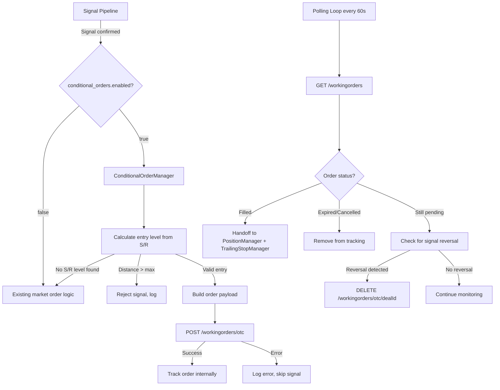
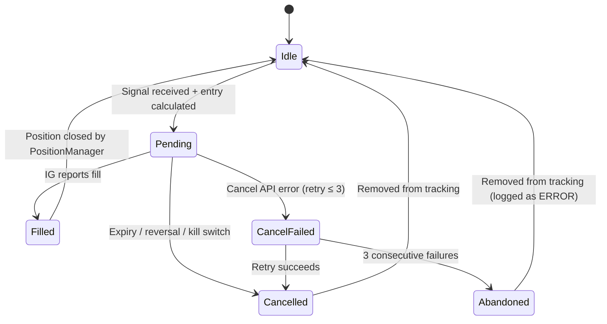

# Design Document: Conditional Order Entry

## Overview

The Conditional Order Entry feature introduces a `ConditionalOrderManager` module that replaces immediate market order execution with strategic pending (working) orders placed at S/R-derived price levels. When a signal passes all filters, the manager calculates an optimal entry level based on the nearest support/resistance zone, adds a configurable buffer to confirm breakout/breakdown, and places a STOP-type working order on the IG platform. Orders auto-expire after a configurable duration, are cancelled on signal reversal or kill switch, and once filled, hand off to the existing `PositionManager` and `TrailingStopManager`.

The feature integrates into the existing signal pipeline in `runners/run_ai_autonomous.py` at the point where `ig.place_order()` is currently called, providing a fail-safe toggle (`conditional_orders.enabled`) that falls back to the existing market order logic when disabled.

## Architecture



### Integration Points

| Component | Role | Interaction |
|-----------|------|-------------|
| `SupportResistanceDetector` | Provides S/R levels | Read-only: `detect_all_levels(df)` |
| `PositionManager` | Tracks filled positions | Write: `add_position(...)` on fill |
| `TrailingStopManager` | Manages trailing stops | Write: `initialize(...)` on fill |
| `IGClient` | Broker API | New methods: `place_working_order()`, `get_working_orders()`, `delete_working_order()` |
| `RiskPositionSizer` | Position sizing | Read: `calculate_size(...)` |
| `config/settings_ai.yaml` | Configuration | Read: `conditional_orders` section |

## Components and Interfaces

### ConditionalOrderManager

**Location:** `broker/conditional_order_manager.py`

```python
class ConditionalOrderManager:
    """Manages conditional (working) order lifecycle."""

    def __init__(self, ig_client: IGClient, config: dict, position_manager, 
                 trailing_manager, sr_detector, log):
        ...

    def process_signal(self, epic: str, direction: str, mid_price: float,
                       sr_levels: dict, stop_pts: float, tp_pts: float,
                       size: float, currency_code: str, confidence: float,
                       patterns: list, atr_value: float) -> dict:
        """
        Main entry point. Calculates entry level and places working order.
        Returns: {"action": "placed"|"rejected"|"fallback"|"skipped", "details": {...}}
        """
        ...

    def calculate_entry_level(self, direction: str, mid_price: float,
                              sr_levels: dict) -> Optional[float]:
        """
        Selects nearest S/R level and applies buffer.
        Returns entry level or None if no suitable level found.
        """
        ...

    def build_order_payload(self, epic: str, direction: str, entry_level: float,
                            size: float, stop_distance: float, 
                            tp_distance: Optional[float], currency_code: str,
                            expiry_timestamp: str) -> dict:
        """Constructs the IG API working order payload."""
        ...

    def poll_orders(self) -> None:
        """
        Polls IG API for tracked order status.
        Handles fills, expirations, cancellations, and signal reversals.
        """
        ...

    def cancel_order(self, epic: str, reason: str) -> bool:
        """Cancels a tracked working order. Returns True on success."""
        ...

    def cancel_all_orders(self, reason: str) -> None:
        """Cancels all tracked working orders (kill switch / daily loss)."""
        ...

    def has_pending_order(self, epic: str) -> bool:
        """Returns True if an active working order exists for the epic."""
        ...

    def _handle_fill(self, epic: str, order_info: dict) -> None:
        """Registers filled position with PositionManager and TrailingStopManager."""
        ...
```

### IGClient Extensions

New methods added to `broker/ig_client.py`:

```python
def place_working_order(self, epic: str, direction: str, level: float,
                        size: float, stop_distance: float,
                        limit_distance: Optional[float],
                        good_till_date: str, currency_code: str = "USD",
                        expiry: str = "-") -> dict:
    """POST /workingorders/otc — places a STOP working order."""
    ...

def get_working_orders(self) -> dict:
    """GET /workingorders — retrieves all active working orders."""
    ...

def delete_working_order(self, deal_id: str) -> dict:
    """DELETE /workingorders/otc/{dealId} — cancels a working order."""
    ...
```

### Configuration Interface

New section in `config/settings_ai.yaml`:

```yaml
conditional_orders:
  enabled: true
  buffer_points: 2.0          # Points beyond S/R level (0.5–50.0)
  order_expiry_seconds: 300   # Auto-cancel after 5 min (60–86400)
  max_entry_distance_points: 30.0  # Reject if entry > 30 pts away (1.0–200.0)
```

## Data Models

### Internal Order Tracking State

```python
@dataclass
class TrackedOrder:
    epic: str
    deal_id: str
    direction: str  # "BUY" or "SELL"
    entry_level: float
    stop_distance: float
    tp_distance: Optional[float]
    size: float
    currency_code: str
    placed_at: datetime  # UTC
    expiry_at: datetime  # UTC
    confidence: float
    patterns: list
    cancel_retry_count: int = 0  # Tracks consecutive cancellation failures
```

### ConditionalOrderManager Internal State

```python
# One order per epic, enforced by dict keying
tracked_orders: Dict[str, TrackedOrder]  # key = epic

# Active signal directions for reconciliation
active_signals: Dict[str, str]  # key = epic, value = direction ("BUY"/"SELL")
```

### Order Lifecycle State Machine



## Correctness Properties

*A property is a characteristic or behavior that should hold true across all valid executions of a system — essentially, a formal statement about what the system should do. Properties serve as the bridge between human-readable specifications and machine-verifiable correctness guarantees.*

### Property 1: Entry Level Calculation

*For any* signal direction (BUY or SELL), list of S/R levels, mid-price, and buffer value within [0.5, 50.0], the calculated entry level SHALL equal the nearest resistance above mid-price plus buffer (for BUY) or the nearest support below mid-price minus buffer (for SELL), where "nearest" means the level with the smallest absolute distance from mid-price among valid candidates.

**Validates: Requirements 1.1, 1.2, 1.7**

### Property 2: Max Distance Rejection

*For any* calculated entry level and current mid-price, if the absolute distance `|entry_level - mid_price|` exceeds the configured `max_entry_distance_points`, then the signal SHALL be rejected and no working order SHALL be placed.

**Validates: Requirements 1.6**

### Property 3: Stop and Take-Profit Calculation with Market Rules

*For any* ATR value, stop_multiplier, min_stop_pts, market minimum stop distance, and rr_take ratio, the final stop distance SHALL be `max(ATR * stop_multiplier, min_stop_pts, market_min_stop)` and when `use_tp_limit` is true, the take-profit distance SHALL equal `final_stop * rr_take`.

**Validates: Requirements 2.2, 2.3, 2.7, 2.9**

### Property 4: Expiry Timestamp Calculation

*For any* current UTC time and `order_expiry_seconds` value within [60, 86400], the `goodTillDate` field SHALL be an ISO 8601 UTC string representing current time plus `order_expiry_seconds`.

**Validates: Requirements 2.5, 3.1**

### Property 5: Order Payload Construction

*For any* valid signal parameters (epic, direction, entry level, size, stop distance, optional TP distance, currency code, and expiry timestamp), the constructed order payload SHALL contain `orderType: "STOP"`, `timeInForce: "GOOD_TILL_DATE"`, and all provided parameters mapped to their correct IG API field names.

**Validates: Requirements 2.1, 2.6**

### Property 6: Signal Direction Handling

*For any* epic with an existing pending order in direction D and a new signal in direction D', the existing order SHALL be cancelled if and only if D ≠ D'. If D = D', the existing order SHALL be kept unchanged and no duplicate placed.

**Validates: Requirements 4.1, 4.2**

### Property 7: One-Order-Per-Epic Invariant

*For any* sequence of order placements and cancellations, the internal tracking state SHALL contain at most one active working order per epic at any point in time.

**Validates: Requirements 5.1**

### Property 8: Order Lifecycle State Machine

*For any* epic, when a working order is filled, it SHALL be removed from tracking and new signals for that epic SHALL be rejected while `PositionManager` holds an open position. When the position is closed, new signals SHALL be accepted again.

**Validates: Requirements 5.2, 5.3, 5.4**

### Property 9: Expired Order Removal

*For any* tracked order that the IG API reports as cancelled or expired, it SHALL be removed from internal tracking state after detection during polling.

**Validates: Requirements 3.3**

### Property 10: Cancellation Retry Logic

*For any* working order cancellation that fails due to API error, the retry count SHALL increment by 1 per failed polling cycle. After 3 consecutive failures, no further retry attempts SHALL be made for that order.

**Validates: Requirements 4.5, 4.6**

### Property 11: Configuration Validation

*For any* configuration where `order_expiry_seconds` is outside [60, 86400], or any required parameter (`enabled`, `buffer_points`, `order_expiry_seconds`, `max_entry_distance_points`) is missing, the system SHALL reject the configuration and fall back to market order execution.

**Validates: Requirements 3.6, 7.3**

### Property 12: Fill Handoff Correctness

*For any* fill event with a fill price, deal ID, direction, size, stop distance, and optional TP distance, the `PositionManager.add_position()` call SHALL be invoked with parameters matching the original order's signal data and the fill price from the IG API response.

**Validates: Requirements 6.1**

## Error Handling

| Scenario | Handling | Recovery |
|----------|----------|----------|
| No S/R level for signal direction | Fall back to market order at current price | Continues normal execution |
| Entry distance exceeds max | Reject signal, log WARNING | Wait for next signal |
| IG API error on order placement | Log error, skip signal | Next polling cycle |
| IG API error on order cancellation | Log WARNING, retry next poll (max 3) | After 3 failures: log ERROR, abandon |
| IG API unreachable during polling | Retain all tracked orders unchanged | Retry on next poll |
| Config parameter missing | Log error, disable conditional orders | Fall back to market order logic |
| Config value out of range | Log error, disable conditional orders | Fall back to market order logic |
| Kill switch activated | Cancel all orders within 30s | Graceful shutdown |
| Daily loss limit reached | Cancel all pending orders | Stop placing new orders |
| Working order fills while system is processing | Detected on next poll cycle | Register position as normal |

## Testing Strategy

### Property-Based Testing (Hypothesis)

This feature is well-suited for property-based testing because the core logic consists of pure calculations (entry level computation, stop/TP derivation, payload construction) and state machine transitions (order lifecycle, one-per-epic invariant) that have universal properties across a wide input space.

**Library:** [Hypothesis](https://hypothesis.readthedocs.io/) (already in use — `.hypothesis/` directory present)

**Configuration:**
- Minimum 100 examples per property test (`@settings(max_examples=100)`)
- Each test tagged with: `# Feature: conditional-order-entry, Property N: <property_text>`

**Property tests cover:**
1. Entry level calculation (pure function)
2. Max distance rejection (pure validation)
3. Stop/TP calculation with market rules (pure function)
4. Expiry timestamp computation (pure function)
5. Order payload construction (pure function)
6. Signal direction handling (state transition)
7. One-order-per-epic invariant (state invariant)
8. Order lifecycle state machine (state transitions)
9. Expired order removal (state transition)
10. Cancellation retry logic (counter state)
11. Configuration validation (pure validation)
12. Fill handoff correctness (data mapping)

### Unit Tests (pytest)

Unit tests target specific examples and edge cases not covered by PBT:
- No S/R level fallback (edge case)
- `use_tp_limit=false` omits TP from payload
- `use_trailing_stop=true/false` branching on fill
- API error handling (mocked failures)
- Kill switch cancellation within timeout
- Daily loss limit bulk cancellation
- Logging output verification (correct level, fields)
- Field extraction from IG API response structure

### Integration Tests

- End-to-end signal → order placement → fill → trailing stop handoff (against IG demo)
- Polling loop detecting fills, expirations, and cancellations
- Configuration loading from `settings_ai.yaml`
- Integration with `run_ai_autonomous.py` signal pipeline
