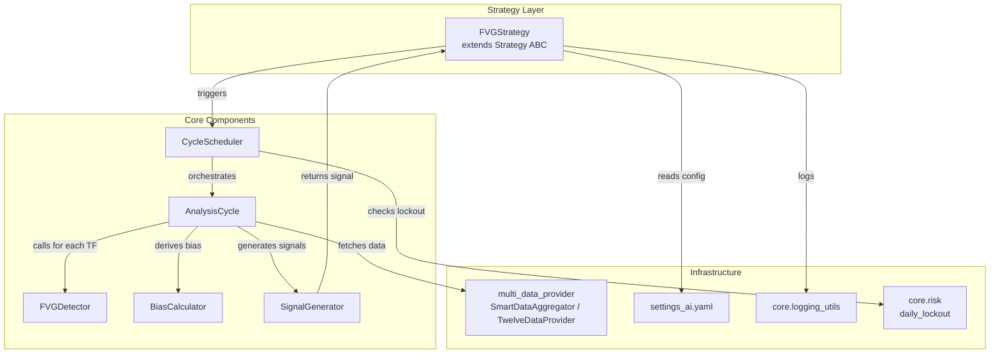
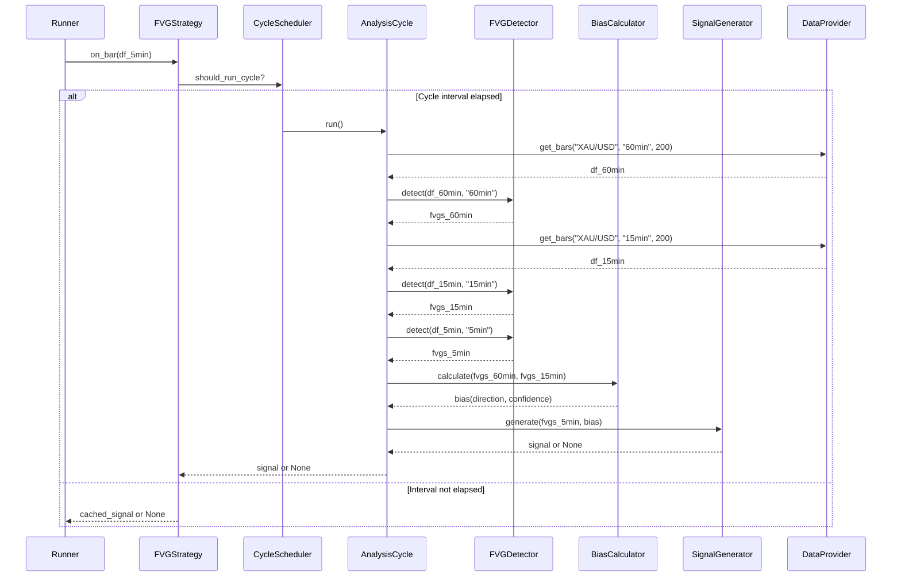

# Design Document: FVG Multi-Timeframe Analysis

## Overview

This feature adds a Fair Value Gap (FVG) multi-timeframe analysis strategy to the IG Scalper bot. It implements a top-down cascade analysis (60min → 15min → 5min) that detects price imbalances (FVGs), derives directional bias from higher timeframes, and generates precise trade entry/exit signals on the 5min chart when alignment exists across all timeframes.

The strategy runs as a repeating analysis cycle on a configurable interval (default 300s), integrates with the existing `strategy.base.Strategy` ABC via `on_bar(df)`, respects TwelveData rate limits through the existing `multi_data_provider` infrastructure, and outputs signals in the standard `{"side", "stop_pts", "tp_pts", "meta"}` format.

### Design Rationale

- **Separation of concerns**: FVG detection is isolated into a pure, stateless detector module; cycle orchestration, bias calculation, and signal generation are distinct components.
- **Reuse existing infrastructure**: Data fetching uses `multi_data_provider.get_bars()` with its built-in caching and rate limiting. Logging uses `core.logging_utils`. Config follows the existing YAML pattern.
- **Testability**: The FVG detector is a pure function over DataFrames — no I/O, no side effects — making it ideal for property-based testing.

## Architecture



### Data Flow



## Components and Interfaces

### 1. FVGDetector (Pure, Stateless)

**Module**: `strategy/fvg_detector.py`

```python
from dataclasses import dataclass, asdict
from datetime import datetime
from typing import List, Optional
import json

@dataclass
class FVG:
    type: str              # "bullish" or "bearish"
    zone_upper: float      # Upper boundary of the gap zone
    zone_lower: float      # Lower boundary of the gap zone
    formation_ts: datetime # Timestamp of the middle candle (candle[i+1])
    source_tf: str         # e.g. "60min", "15min", "5min"
    fill_status: str = "unfilled"  # "unfilled", "partial", "filled"
    age_bars: int = 0      # Bars elapsed since formation

    def to_dict(self) -> dict:
        """Serialize to JSON-safe dict."""
        return {
            "type": self.type,
            "zone_upper": self.zone_upper,
            "zone_lower": self.zone_lower,
            "formation_ts": self.formation_ts.isoformat(),
            "source_tf": self.source_tf,
            "fill_status": self.fill_status,
            "age_bars": self.age_bars,
        }

    @classmethod
    def from_dict(cls, d: dict) -> "FVG":
        """Deserialize from dict."""
        return cls(
            type=d["type"],
            zone_upper=d["zone_upper"],
            zone_lower=d["zone_lower"],
            formation_ts=datetime.fromisoformat(d["formation_ts"]),
            source_tf=d["source_tf"],
            fill_status=d.get("fill_status", "unfilled"),
            age_bars=d.get("age_bars", 0),
        )


class FVGDetector:
    """Pure FVG detection on OHLC DataFrames. No I/O, no state."""

    def detect(self, df: pd.DataFrame, timeframe: str) -> List[FVG]:
        """
        Scan all 3-candle windows up through penultimate bar (iloc[-2]).
        Returns list of detected FVGs.
        """
        ...

    def update_fill_status(self, fvgs: List[FVG], df: pd.DataFrame, max_age: int) -> List[FVG]:
        """
        Process bars chronologically, update fill status, expire old FVGs.
        Returns only unfilled/partial FVGs.
        """
        ...
```

### 2. BiasCalculator (Pure, Stateless)

**Module**: `strategy/fvg_bias.py`

```python
@dataclass
class Bias:
    direction: str     # "bullish", "bearish", "neutral"
    confidence: float  # 0.0 to 1.0

class BiasCalculator:
    """Derives directional bias from higher-timeframe FVGs."""

    def calculate_60min_bias(self, fvgs_60min: List[FVG]) -> Bias:
        """
        Count unfilled bullish vs bearish FVGs.
        confidence = abs(bull - bear) / (bull + bear)
        """
        ...

    def adjust_with_15min(self, bias: Bias, fvgs_15min: List[FVG]) -> Bias:
        """
        If 15min majority matches 60min direction: confidence += 0.2 (cap 1.0)
        If 15min opposes: confidence -= 0.3 (floor 0.0), direction unchanged
        """
        ...
```

### 3. SignalGenerator

**Module**: `strategy/fvg_signal.py`

```python
class SignalGenerator:
    """Produces trade signals from 5min FVGs aligned with bias."""

    def __init__(self, stop_buffer: float, min_confidence: float):
        self.stop_buffer = stop_buffer
        self.min_confidence = min_confidence

    def generate(
        self,
        fvgs_5min: List[FVG],
        bias: Bias,
        fvgs_higher_tf: List[FVG],
    ) -> Optional[dict]:
        """
        Returns {"side", "stop_pts", "tp_pts", "meta"} or None.
        - Selects most recent unfilled 5min FVG matching bias direction.
        - Entry at FVG zone boundary.
        - Stop beyond opposite boundary + buffer.
        - TP at nearest HTF zone or opposite side of triggering zone.
        - Discards if TP <= SL distance (unfavorable R:R).
        """
        ...
```

### 4. CycleScheduler

**Module**: `strategy/fvg_scheduler.py`

```python
class CycleScheduler:
    """Manages cycle timing, kill switch, and lockout checks."""

    def __init__(self, interval_seconds: int):
        self.interval = interval_seconds
        self._last_cycle_time: float = 0
        self._cycle_running: bool = False

    def should_run(self) -> bool:
        """
        True if:
        - interval elapsed since last cycle
        - KILL_SWITCH != "1"
        - daily_lockout is not active
        - previous cycle is not still running
        """
        ...

    def mark_cycle_start(self) -> None: ...
    def mark_cycle_complete(self) -> None: ...
```

### 5. FVGStrategy (Orchestrator)

**Module**: `strategy/fvg_strategy.py`

```python
class FVGStrategy(Strategy):
    """
    Multi-timeframe FVG strategy extending the Strategy ABC.
    Orchestrates the analysis cycle and caches signals.
    """

    def __init__(self, config: dict, data_provider):
        self.detector = FVGDetector()
        self.bias_calc = BiasCalculator()
        self.signal_gen = SignalGenerator(
            stop_buffer=config["stop_buffer_points"],
            min_confidence=config["min_bias_confidence"],
        )
        self.scheduler = CycleScheduler(config["cycle_interval_seconds"])
        self.data_provider = data_provider
        self.config = config
        self._cached_signal: Optional[dict] = None
        self._active_fvgs: Dict[str, List[FVG]] = {}

    def on_bar(self, df: pd.DataFrame) -> Optional[dict]:
        """
        Called with 5min DataFrame. Triggers cycle if interval elapsed,
        otherwise returns cached signal.
        """
        ...

    def _run_analysis_cycle(self, df_5min: pd.DataFrame) -> Optional[dict]:
        """Execute the full 60min → 15min → 5min cascade."""
        ...
```

## Data Models

### FVG Dataclass

| Field | Type | Description |
|-------|------|-------------|
| `type` | `str` | `"bullish"` or `"bearish"` |
| `zone_upper` | `float` | Upper boundary of the FVG zone |
| `zone_lower` | `float` | Lower boundary of the FVG zone |
| `formation_ts` | `datetime` | Timestamp of the middle candle |
| `source_tf` | `str` | Source timeframe label |
| `fill_status` | `str` | `"unfilled"`, `"partial"`, `"filled"` |
| `age_bars` | `int` | Bars elapsed since formation |

### Bias Dataclass

| Field | Type | Description |
|-------|------|-------------|
| `direction` | `str` | `"bullish"`, `"bearish"`, `"neutral"` |
| `confidence` | `float` | Score from 0.0 to 1.0 |

### Signal Output Format

```python
{
    "side": "BUY" | "SELL",
    "stop_pts": float,   # Distance from entry to stop loss
    "tp_pts": float,     # Distance from entry to take profit
    "meta": {
        "bias_direction": str,
        "bias_confidence": float,
        "trigger_fvg": {
            "type": str,
            "zone_upper": float,
            "zone_lower": float,
            "source_tf": str,
        },
        "fvgs_60min": [...],
        "fvgs_15min": [...],
        "fvgs_5min": [...],
        "entry_zone": (float, float),
    }
}
```

### Configuration Schema (`settings_ai.yaml`)

```yaml
fvg_strategy:
  cycle_interval_seconds: 300    # 5 minutes between cycles
  timeframes:
    - "60min"
    - "15min"
    - "5min"
  fvg_max_age_bars: 50           # Expire FVGs older than 50 bars
  stop_buffer_points: 2.0        # Buffer beyond FVG boundary for stop
  min_bias_confidence: 0.6       # Minimum confidence to generate signal
  lookback_candles: 200          # Bars to fetch per timeframe
```


## Correctness Properties

These properties define the formal correctness guarantees of the FVG system and will be validated through property-based tests.

### Property 1: FVG Zone Validity
For all detected FVGs: `zone_upper > zone_lower` and both values are positive finite floats.
**Validates: Requirements 1.2, 1.3**

### Property 2: Detection Completeness
For any OHLC DataFrame with N valid bars (N ≥ 3), the number of detected FVGs is at most N-2 (one per 3-candle window).
**Validates: Requirements 1.1**

### Property 3: Fill Monotonicity
Once an FVG is marked "filled", it SHALL NOT revert to "unfilled" or "partial" on any subsequent bar update.
**Validates: Requirements 2.1, 2.2**

### Property 4: Bias Confidence Bounds
For all bias calculations: `0.0 ≤ confidence ≤ 1.0`.
**Validates: Requirements 3.3, 3.4, 3.5**

### Property 5: Signal-Bias Alignment
If a signal is produced with `side="BUY"`, then `bias.direction == "bullish"`. If `side="SELL"`, then `bias.direction == "bearish"`. No signal is produced when bias is "neutral".
**Validates: Requirements 4.1, 4.2, 4.7**

### Property 6: Risk-Reward Sanity
For all generated signals: `tp_pts > stop_pts > 0`. Signals with unfavorable R:R are discarded.
**Validates: Requirements 4.5**

### Property 7: Rate Limit Invariant
Across any 60-second window, the total TwelveData API calls made by the FVG cycle SHALL NOT exceed 8. Across any 24-hour window, total calls SHALL NOT exceed 800.
**Validates: Requirements 6.1, 6.2, 6.3**

### Property 8: Round-Trip Serialization
For any FVG object `f`: `FVG.from_dict(f.to_dict()) == f`.
**Validates: Requirements 1.7**

### Property 9: Age Expiry
No FVG with `age_bars > max_age` SHALL appear in the active FVG set or be used for signal generation.
**Validates: Requirements 2.4, 2.5**

## Error Handling

| Scenario | Handler | Behavior |
|----------|---------|----------|
| TwelveData returns empty DataFrame for a timeframe | `AnalysisCycle._run()` | Abort cycle, log failed timeframe, return None |
| TwelveData rate limit exhausted (daily) | `TwelveDataProvider.get_bars()` | Return empty DataFrame, log budget status |
| TwelveData rate limit exhausted (per-minute) | `TwelveDataProvider.get_bars()` | Sleep until sliding window clears, then retry |
| Network timeout fetching bar data | `TwelveDataProvider.get_bars()` | Return empty DataFrame, cycle aborts gracefully |
| DataFrame has NaN in OHLC columns | `FVGDetector.detect()` | Skip affected 3-candle windows, continue scanning |
| No unfilled FVGs on 60min | `BiasCalculator` | Return neutral bias with confidence 0.0, cycle skips signal generation |
| KILL_SWITCH env var set to "1" | `CycleScheduler.should_run()` | Return False, no cycle executes |
| Daily loss lockout active | `CycleScheduler.should_run()` | Return False, pause until lockout clears |
| Config key missing from YAML | `FVGStrategy.__init__()` | Use documented default, log warning |
| Invalid config value (negative interval, empty list) | `FVGStrategy.__init__()` | Raise `ValueError` with descriptive message |
| Previous cycle still running when next interval fires | `CycleScheduler.should_run()` | Return False, log overlap warning |

## Testing Strategy

### Unit Tests

| Component | Test Focus | Method |
|-----------|-----------|--------|
| `FVGDetector.detect()` | Correct identification of bullish/bearish FVGs | Handcrafted OHLC DataFrames with known FVG patterns |
| `FVGDetector.detect()` | Handles edge cases (< 3 bars, NaN values, flat data) | Boundary value tests |
| `FVGDetector.update_fill_status()` | Correct partial/full fill marking | Sequential bar updates with known fills |
| `BiasCalculator` | Correct bias direction and confidence formula | Parametrized with various FVG count ratios |
| `SignalGenerator` | Signal only when alignment + confidence met | Combinations of bias/FVG alignment scenarios |
| `SignalGenerator` | Discards signals with TP ≤ SL | Edge case zones |
| `CycleScheduler` | Timing, kill switch, lockout respect | Mock time and env vars |

### Property-Based Tests (Hypothesis)

| Property | Generator | Assertion |
|----------|-----------|-----------|
| P1: Zone Validity | Random OHLC DataFrames (100-500 rows, realistic gold prices 3000-5000) | All FVGs have `zone_upper > zone_lower > 0` |
| P2: Detection Completeness | Random OHLC DataFrames | `len(fvgs) <= len(df) - 2` |
| P3: Fill Monotonicity | Random FVG + sequence of bars | Fill status only moves forward: unfilled → partial → filled |
| P4: Bias Bounds | Random lists of FVG objects | `0.0 <= confidence <= 1.0` |
| P5: Signal-Bias Alignment | Random FVGs + random bias | Signal side matches bias direction |
| P8: Round-Trip | Random FVG objects | `from_dict(to_dict(fvg)) == fvg` |

### Integration Tests

| Test | What it validates |
|------|-------------------|
| Full cycle with mocked DataProvider | Entire 60min → 15min → 5min cascade produces correct signal |
| Rate limit compliance under rapid calls | 10 rapid `on_bar()` calls don't exceed TwelveData limits |
| Cache behavior | Second `on_bar()` within interval returns cached signal |
| End-to-end with real TwelveData data | Manual/CI smoke test with real API (limited to 1 run) |
