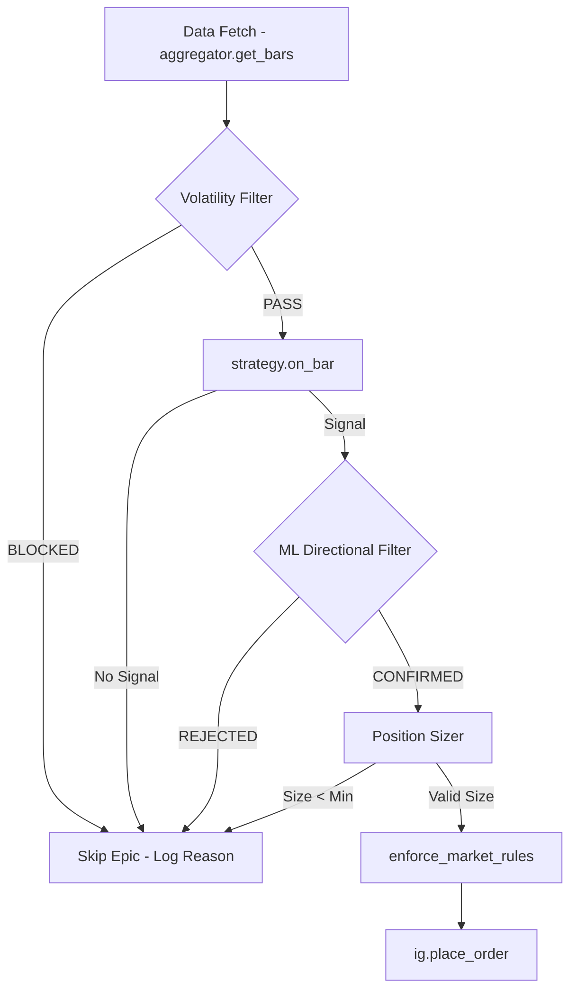

# Design Document: ML Trading Improvements

## Overview

This design adds three composable filters to the IG Scalper trading pipeline:

1. **ML Directional Filter** — a logistic regression model trained on technical features (RSI, ATR ratio, SMA ratio, lagged returns) that confirms or rejects signals based on predicted next-bar direction.
2. **Volatility Regime Filter** — an ATR-percentile gate that blocks trading when market conditions are too volatile (chaos) or too quiet (no edge).
3. **Risk-Per-Trade Position Sizer** — replaces the fixed `invest_per_trade` approach with equity-based dynamic sizing using actual stop distance and pip value.

All three are independently configurable via `config/settings_ai.yaml` and integrate into the existing epic-processing loop in `runners/run_ai_autonomous.py` at specific points:

```
Epic Processing Order (updated):
  data fetch → volatility filter → strategy.on_bar() → ML filter → position sizer → order placement
```

Each component can be disabled independently, falling back to existing behavior (pass-through for filters, fixed sizing for position sizer).

## Architecture



### Module Layout

```
strategy/
  ml_filter.py          # NEW: MLDirectionalFilter class
  volatility_filter.py  # NEW: VolatilityRegimeFilter class
core/
  position_sizer.py     # NEW: RiskPositionSizer class
  risk.py               # EXISTING: keep size_by_invested_capital as fallback
```

### Design Rationale

- **Separate modules** rather than embedding in `AIPatternRecognizer` — each filter is independently testable, configurable, and can be reused across strategy types (AI, FVG, hybrid).
- **Placed in `strategy/`** for filters because they operate on price/signal data. Position sizer goes in `core/` because it's a risk-management concern shared across all strategies.
- **No changes to `Strategy` ABC** — filters wrap around `on_bar()` rather than modifying its interface, maintaining backward compatibility.

## Components and Interfaces

### 1. MLDirectionalFilter (`strategy/ml_filter.py`)

```python
class MLDirectionalFilter:
    """Logistic regression filter that confirms/rejects signals based on
    predicted next-bar direction."""

    def __init__(self, config: dict):
        """
        config keys:
          enabled: bool
          probability_threshold: float (default 0.55)
          rolling_window_bars: int (default 500)
          retrain_interval_hours: int (default 168)
          model_path: str (default "data/ml_model.joblib")
          model_type: str ("logistic_regression" | "random_forest")
        """

    def train(self, df: pd.DataFrame) -> bool:
        """Train model on DataFrame. Returns True if successful."""

    def extract_features(self, df: pd.DataFrame) -> np.ndarray:
        """Extract feature matrix: RSI(14), ATR_Ratio, SMA_Ratio, ret_1, ret_3, ret_5.
        Returns shape (n_samples, 6)."""

    def generate_labels(self, df: pd.DataFrame) -> np.ndarray:
        """Generate binary labels: 1 if next close > current close, else 0.
        Returns shape (n_samples,)."""

    def normalize(self, features: np.ndarray) -> np.ndarray:
        """Z-score normalize features using stored mean/std from training."""

    def predict_probability(self, df: pd.DataFrame) -> float:
        """Return P(bullish) for the current (penultimate) bar. Range [0.0, 1.0]."""

    def confirm_signal(self, signal: dict, df: pd.DataFrame) -> tuple[bool, dict]:
        """
        Returns (confirmed: bool, metadata: dict).
        metadata includes: probability, threshold, direction, reason.
        """

    def should_retrain(self) -> bool:
        """Check if retrain interval has elapsed."""

    def retrain(self, df: pd.DataFrame) -> bool:
        """Retrain on latest data, save to disk. Returns True if successful."""

    @property
    def is_enabled(self) -> bool:
        """False if config disabled or insufficient training data."""
```

### 2. VolatilityRegimeFilter (`strategy/volatility_filter.py`)

```python
class VolatilityRegimeFilter:
    """ATR-percentile gate that blocks trading in extreme volatility regimes."""

    def __init__(self, config: dict):
        """
        config keys:
          enabled: bool
          atr_period: int (default 14)
          lookback_bars: int (default 100)
          lower_percentile: float (default 20.0)
          upper_percentile: float (default 80.0)
        """

    def compute_atr_ratio(self, df: pd.DataFrame) -> float:
        """ATR(period) / close for the penultimate bar."""

    def update_history(self, atr_ratio: float) -> None:
        """Append to rolling history, trimming to lookback_bars."""

    def compute_percentile(self, current_ratio: float) -> float:
        """Percentile rank of current_ratio within history. Range [0, 100]."""

    def allow_trading(self, df: pd.DataFrame) -> tuple[bool, dict]:
        """
        Returns (allowed: bool, metadata: dict).
        metadata includes: atr_ratio, percentile, reason.
        """
```

### 3. RiskPositionSizer (`core/position_sizer.py`)

```python
class RiskPositionSizer:
    """Equity-based position sizing: size = (equity × risk%) / (stop × pip_value)."""

    def __init__(self, config: dict, ig_client):
        """
        config keys:
          risk_pct_per_trade: float (default 2.0)
          equity_refresh_interval_seconds: int (default 300)
          use_dynamic_sizing: bool (default True)
          max_size_multiple: int (default 50)
        """

    def refresh_equity(self) -> float:
        """Fetch account balance from IG API. Cache on failure."""

    def calculate_size(self, stop_distance: float, pip_value: float,
                       min_size: float, size_step: float) -> tuple[float | None, dict]:
        """
        Returns (size or None if rejected, metadata: dict).
        metadata includes: equity, raw_size, capped_size, reason.
        None means risk budget insufficient for minimum size.
        """

    def get_equity(self) -> float:
        """Return current cached equity."""
```

### Integration in Runner

The runner (`runners/run_ai_autonomous.py`) changes are minimal — initialize the three components at startup, then insert them into the epic-processing loop:

```python
# At startup (after strategy init):
from strategy.ml_filter import MLDirectionalFilter
from strategy.volatility_filter import VolatilityRegimeFilter
from core.position_sizer import RiskPositionSizer

ml_filter = MLDirectionalFilter(cfg.get("ml_filter", {}))
vol_filter = VolatilityRegimeFilter(cfg.get("volatility_filter", {}))
position_sizer = RiskPositionSizer(cfg.get("risk", {}), ig)

# Initial ML training (needs bars from first epic)
if ml_filter.is_enabled:
    init_df = aggregator.get_bars(epics[0], timeframe, limit=500)
    ml_filter.train(init_df)

# In epic loop (replacing current sizing logic):
# 1. Volatility gate (before on_bar)
allowed, vol_meta = vol_filter.allow_trading(df)
if not allowed:
    log.info(f"🌡️ Volatility filter BLOCKED {epic}: {vol_meta['reason']}")
    continue

# 2. Strategy signal (existing)
signal = strategy.on_bar(df)

# 3. ML confirmation (after signal, before order)
if signal and ml_filter.is_enabled:
    confirmed, ml_meta = ml_filter.confirm_signal(signal, df)
    if not confirmed:
        log.info(f"🧠 ML filter REJECTED {epic}: {ml_meta['reason']}")
        continue

# 4. Position sizing (replaces size_by_invested_capital call)
if cfg["risk"].get("use_dynamic_sizing", True):
    size, size_meta = position_sizer.calculate_size(
        stop_distance=signal["stop_pts"],
        pip_value=pip_value,
        min_size=mkt["dealingRules"]["minDealSize"]["value"],
        size_step=0.1
    )
    if size is None:
        log.info(f"💰 Position sizer REJECTED {epic}: {size_meta['reason']}")
        continue  # No cooldown
else:
    # Fallback to existing logic
    size, _ = size_by_invested_capital(...)
```

## Data Models

### ML Feature Matrix

| Column | Computation | Range |
|--------|-------------|-------|
| `rsi_14` | 14-period RSI | [0, 100] |
| `atr_ratio` | ATR(14) / close | (0, +∞) |
| `sma_ratio` | close / SMA(50) | (0, +∞) |
| `ret_1` | (close - close[1]) / close[1] | (-1, +∞) |
| `ret_3` | (close - close[3]) / close[3] | (-1, +∞) |
| `ret_5` | (close - close[5]) / close[5] | (-1, +∞) |

Features are extracted from the penultimate bar (`iloc[-2]`) consistent with the existing strategy convention.

### Model Metadata (persisted with joblib)

```python
{
    "model": fitted_sklearn_model,
    "scaler_mean": np.ndarray,   # shape (6,)
    "scaler_std": np.ndarray,    # shape (6,)
    "last_trained_at": "2024-01-15T10:30:00+01:00",
    "training_samples": 485,
    "model_type": "logistic_regression",
    "feature_names": ["rsi_14", "atr_ratio", "sma_ratio", "ret_1", "ret_3", "ret_5"]
}
```

### Volatility Filter State

```python
{
    "history": collections.deque(maxlen=lookback_bars),  # float ATR ratios
    "last_atr_ratio": float,
    "last_percentile": float
}
```

### Position Sizer State

```python
{
    "cached_equity": float,
    "last_refresh_time": float,  # time.time()
    "refresh_interval": int      # seconds
}
```

### YAML Config Additions (`config/settings_ai.yaml`)

```yaml
ml_filter:
  enabled: true
  probability_threshold: 0.55
  rolling_window_bars: 500
  retrain_interval_hours: 168
  model_path: "data/ml_model.joblib"
  model_type: "logistic_regression"  # or "random_forest"

volatility_filter:
  enabled: true
  atr_period: 14
  lookback_bars: 100
  lower_percentile: 20.0
  upper_percentile: 80.0

risk:
  # Existing fields preserved:
  account_equity: 10000
  invest_per_trade: 1000
  max_loss_pct_invest: 5.0
  max_daily_loss_pct: 3.0
  max_losing_trades: 3
  # New fields:
  risk_pct_per_trade: 2.0
  equity_refresh_interval_seconds: 300
  use_dynamic_sizing: true
  max_size_multiple: 50
```

## Correctness Properties

*A property is a characteristic or behavior that should hold true across all valid executions of a system — essentially, a formal statement about what the system should do. Properties serve as the bridge between human-readable specifications and machine-verifiable correctness guarantees.*

### Property 1: Feature extraction produces correct dimensions and valid ranges

*For any* valid OHLC DataFrame with at least 50 rows, `extract_features()` SHALL return a matrix with exactly 6 columns where: RSI values are in [0, 100], ATR_Ratio values are > 0, SMA_Ratio values are > 0, and return values are finite floats.

**Validates: Requirements 1.2**

### Property 2: Label generation correctness

*For any* valid OHLC DataFrame, `generate_labels()` SHALL produce a binary array where label[i] == 1 if and only if close[i+1] > close[i], and label[i] == 0 otherwise.

**Validates: Requirements 1.3**

### Property 3: Z-score normalization produces zero-mean unit-variance columns

*For any* feature matrix with more than 1 row where at least one column has non-zero variance, after z-score normalization each column SHALL have mean ≈ 0 (within 1e-7) and standard deviation ≈ 1 (within 1e-7).

**Validates: Requirements 1.4**

### Property 4: Insufficient data disables ML filter

*For any* DataFrame with fewer than 100 rows, after calling `train()`, the ML filter's `is_enabled` property SHALL be False.

**Validates: Requirements 1.5**

### Property 5: Prediction probability bounded to [0, 1]

*For any* valid feature vector passed to a trained model, `predict_probability()` SHALL return a value in the closed interval [0.0, 1.0].

**Validates: Requirements 2.1**

### Property 6: ML signal confirmation follows threshold rule

*For any* signal with direction D, probability P, and threshold T: if D is BUY, the signal is confirmed iff P > T; if D is SELL, the signal is confirmed iff (1 - P) > T.

**Validates: Requirements 2.2, 2.3**

### Property 7: Disabled ML filter passes all signals

*For any* signal, when the ML filter is disabled (either `enabled=false` in config or insufficient training data), `confirm_signal()` SHALL return `(True, ...)`.

**Validates: Requirements 2.5, 4.3**

### Property 8: ATR Ratio computation correctness

*For any* valid OHLC DataFrame with at least `atr_period` rows, `compute_atr_ratio()` SHALL return ATR(period) / close for the penultimate bar, and the result SHALL be > 0.

**Validates: Requirements 5.1**

### Property 9: Volatility history buffer is bounded

*For any* sequence of N calls to `update_history()` where N > lookback_bars, the internal history length SHALL never exceed lookback_bars.

**Validates: Requirements 5.2**

### Property 10: Percentile rank correctness

*For any* current ATR_Ratio value and history of length ≥ 1, `compute_percentile()` SHALL return a value equal to (count of history values ≤ current_ratio) / len(history) × 100, which is always in [0, 100].

**Validates: Requirements 5.3**

### Property 11: Insufficient volatility history allows trading

*For any* ATR_Ratio value, when the volatility history contains fewer than 20 entries, `allow_trading()` SHALL return `(True, ...)`.

**Validates: Requirements 5.4**

### Property 12: Volatility gate blocks outside configured bounds

*For any* ATR_Percentile P and configured bounds [lower, upper], the volatility filter SHALL block trading if and only if P > upper OR P < lower (when history has ≥ 20 entries).

**Validates: Requirements 6.1, 6.2**

### Property 13: Disabled volatility filter allows all

*For any* DataFrame, when `volatility_filter.enabled` is false, `allow_trading()` SHALL return `(True, ...)`.

**Validates: Requirements 7.3**

### Property 14: Position size formula correctness

*For any* positive values of equity, risk_pct, stop_distance, and pip_value, `calculate_size()` SHALL return a size equal to floor((equity × risk_pct / 100) / (stop_distance × pip_value) / step) × step.

**Validates: Requirements 8.1**

### Property 15: Position size rounding

*For any* calculated raw size and size_step > 0, the returned size SHALL equal floor(raw_size / step) × step (rounding down to nearest valid increment).

**Validates: Requirements 8.6**

### Property 16: Size below minimum rejects trade

*For any* combination of equity, risk_pct, stop_distance, and pip_value where the formula yields a value less than min_size, `calculate_size()` SHALL return None.

**Validates: Requirements 8.5**

### Property 17: Size capped at maximum multiple

*For any* combination of inputs where the formula yields a value exceeding min_size × max_size_multiple, `calculate_size()` SHALL return min_size × max_size_multiple (capped).

**Validates: Requirements 10.4**

### Property 18: Fallback to fixed sizing when dynamic disabled

*For any* signal, when `use_dynamic_sizing` is false, the position sizer SHALL produce the same result as the existing `size_by_invested_capital()` function.

**Validates: Requirements 10.3**

## Error Handling

| Scenario | Handling | Recovery |
|----------|----------|----------|
| ML training fails (insufficient data) | Log warning, set `is_enabled = False` | Retry on next retrain interval; pass all signals through meanwhile |
| ML prediction fails (NaN features) | Log error, return confirmed=True (fail-open) | Skip ML filtering for this bar only |
| Model file corrupt on load | Log error, retrain from scratch | Falls back to training from live data |
| Volatility history empty | Allow trading, log insufficient history | History fills naturally as bars arrive |
| IG equity API fails | Use last cached value, log warning | Retry on next refresh interval |
| Position size below minimum | Reject trade (return None), log reason | No cooldown — allows retry next bar |
| Division by zero (stop=0 or pip_value=0) | Return None, log error | Defensive check before formula |
| Retrain interval elapsed but no data | Continue using existing model, log warning | Retry next interval |

**Fail-Open Philosophy**: All filters default to pass-through when encountering errors. The system should never miss a valid trade due to a filter malfunction — it's better to occasionally take an unfiltered trade than to silently block all trading.

## Testing Strategy

### Property-Based Tests (Hypothesis)

The project already uses Hypothesis (evidenced by `.hypothesis/` directory). Each correctness property above maps to a property-based test.

**Library**: `hypothesis` (already in use)
**Minimum iterations**: 100 per property
**Tag format**: `# Feature: ml-trading-improvements, Property {N}: {title}`

Property tests cover:
- Feature extraction (Property 1)
- Label generation (Property 2)
- Z-score normalization (Property 3)
- Insufficient data handling (Property 4)
- Prediction bounds (Property 5)
- Signal confirmation logic (Property 6)
- Disabled filter pass-through (Properties 7, 13)
- ATR ratio computation (Property 8)
- History buffer bounds (Property 9)
- Percentile calculation (Property 10)
- Insufficient history pass-through (Property 11)
- Volatility gate logic (Property 12)
- Position size formula (Property 14)
- Rounding behavior (Property 15)
- Min/max size enforcement (Properties 16, 17)
- Fallback sizing (Property 18)

### Unit Tests (pytest)

Example-based tests for:
- Model save/load round-trip (Req 1.6, 3.2)
- Retrain trigger after time elapsed (Req 3.1)
- Log message content on rejection (Req 2.4, 6.3, 6.4)
- Config parsing with defaults (Req 4.1, 7.1, 10.1)
- Equity refresh with mocked IG client (Req 9.1, 9.2, 9.3)

### Integration Tests

- Full pipeline: volatility → on_bar → ML → sizing → order (Req 11.1–11.5)
- Verify execution order via mock call sequence
- Verify no cooldown on position sizer rejection (Req 11.5)

### Test File Layout

```
tests/
  test_ml_filter.py           # Property + unit tests for MLDirectionalFilter
  test_volatility_filter.py   # Property + unit tests for VolatilityRegimeFilter
  test_position_sizer.py      # Property + unit tests for RiskPositionSizer
  test_pipeline_integration.py # Integration tests for runner loop
```
