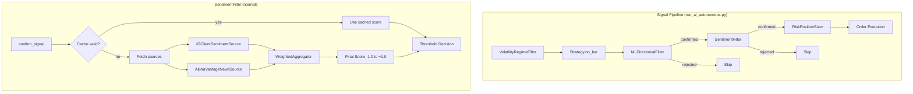

# Design Document: Sentiment Analysis Filter

## Overview

The Sentiment Analysis Filter is a signal confirmation module that evaluates Gold market sentiment from multiple sources and confirms or rejects trade signals based on sentiment alignment with the proposed trade direction. It slots into the existing filter pipeline after the ML Directional Filter and before the Position Sizer.

The module follows the same architectural patterns as `MLDirectionalFilter` and `VolatilityRegimeFilter`:
- Same `confirm_signal(signal, df) -> tuple[bool, dict]` interface
- Fail-open philosophy (errors never block trades)
- Configuration via `config/settings_ai.yaml`
- Logging via `core.logging_utils`

**Key design decisions:**
1. **Contrarian interpretation** of IG retail positioning (extreme long = bearish signal)
2. **Weighted aggregation** of multiple sentiment sources into a single [-1.0, +1.0] score
3. **In-memory TTL cache** to respect API rate limits without external dependencies
4. **Pass-through mode** as the default failure state — sentiment is advisory, not gating

## Architecture



## Components and Interfaces

### 1. `SentimentFilter` (strategy/sentiment_filter.py)

The main orchestrator class. Matches the `MLDirectionalFilter.confirm_signal()` interface.

```python
class SentimentFilter:
    def __init__(self, config: dict, ig_client: IGClient | None = None):
        """
        config keys:
          enabled: bool (default True)
          sentiment_threshold: float (default 0.3)
          cache_ttl_seconds: int (default 300)
          sources: list[dict] — provider configurations
          source_weights: dict[str, float] — e.g. {"ig_client": 0.6, "news": 0.4}
        """

    def confirm_signal(self, signal: dict, df: pd.DataFrame) -> tuple[bool, dict]:
        """
        Returns (confirmed: bool, metadata: dict).
        metadata includes: sentiment_score, sources, cache_hit, confirmed, reason.
        Fail-open: any error → (True, {error details}).
        """

    def get_sentiment_score(self) -> tuple[float, dict]:
        """
        Fetch/compute aggregated sentiment score.
        Returns (score: float in [-1.0, 1.0], source_details: dict).
        """
```

### 2. `SentimentSource` (Protocol / ABC)

Base interface for all sentiment data providers.

```python
from typing import Protocol

class SentimentSource(Protocol):
    @property
    def name(self) -> str: ...

    def fetch_score(self) -> float | None:
        """
        Return sentiment score in [-1.0, +1.0] or None if unavailable.
        Must handle its own timeouts and errors internally.
        """
```

### 3. `IGClientSentimentSource`

Fetches IG client positioning via `/clientsentiment/{marketId}` and applies contrarian interpretation.

```python
class IGClientSentimentSource:
    def __init__(self, ig_client: IGClient, market_id: str = "GOLD"):
        ...

    def fetch_score(self) -> float | None:
        """
        Contrarian logic:
        - long_pct > 70%: score = -(long_pct - 50) / 50  → range [-1.0, -0.4]
        - short_pct > 70%: score = +(short_pct - 50) / 50 → range [+0.4, +1.0]
        - Both 30%-70%: score = 0.0 (neutral)
        """
```

### 4. `AlphaVantageNewsSource`

Fetches Gold-related news sentiment from Alpha Vantage News & Sentiment API.

```python
class AlphaVantageNewsSource:
    def __init__(self, api_key: str, lookback_hours: int = 4, min_articles: int = 3):
        ...

    def fetch_score(self) -> float | None:
        """
        Fetches news articles, filters to Gold-related within lookback window,
        computes weighted average of sentiment scores.
        Returns None if fewer than min_articles available.
        """
```

### 5. `SentimentCache`

Simple in-memory TTL cache with no external dependencies.

```python
class SentimentCache:
    def __init__(self, ttl_seconds: int = 300):
        ...

    def get(self) -> tuple[float, dict] | None:
        """Return cached (score, details) if within TTL, else None."""

    def set(self, score: float, details: dict) -> None:
        """Store score with current timestamp."""

    def is_valid(self) -> bool:
        """True if cache has data within TTL."""
```

### 6. `WeightedAggregator`

Combines multiple source scores using configurable weights.

```python
class WeightedAggregator:
    def __init__(self, weights: dict[str, float]):
        ...

    def aggregate(self, scores: dict[str, float | None]) -> float:
        """
        Weighted average of non-None scores, normalized to [-1.0, +1.0].
        If all None → 0.0.
        """
```

## Data Models

### Signal Dict (input — same as MLDirectionalFilter)

```python
signal = {
    "side": "BUY" | "SELL",
    "stop_pts": float,
    "tp_pts": float,
    "meta": dict  # existing metadata from strategy + ML filter
}
```

### Sentiment Metadata (output — appended to signal.meta)

```python
sentiment_meta = {
    "sentiment_score": float,        # [-1.0, +1.0]
    "sentiment_threshold": float,    # configured threshold
    "sentiment_confirmed": bool,
    "sentiment_cache_hit": bool,
    "sentiment_sources": {
        "ig_client": float | None,   # individual source score
        "news": float | None,
    },
    "sentiment_reason": str,         # human-readable decision explanation
}
```

### Configuration Schema (config/settings_ai.yaml)

```yaml
sentiment_filter:
  enabled: true
  sentiment_threshold: 0.3          # reject if score opposes direction beyond this
  cache_ttl_seconds: 300            # 5 minutes
  source_weights:
    ig_client: 0.6
    news: 0.4
  sources:
    ig_client:
      enabled: true
      market_id: "GOLD"
      timeout_seconds: 10
    news:
      enabled: true
      provider: "alpha_vantage"     # or "newsapi"
      api_key: "${ALPHA_VANTAGE_KEY}"
      lookback_hours: 4
      min_articles: 3
      timeout_seconds: 15
      max_requests_per_hour: 5
```

### Cache Entry (internal)

```python
@dataclass
class CacheEntry:
    score: float
    source_details: dict[str, float | None]
    timestamp: float    # time.time()
    ttl_seconds: int
```


## Correctness Properties

*A property is a characteristic or behavior that should hold true across all valid executions of a system — essentially, a formal statement about what the system should do. Properties serve as the bridge between human-readable specifications and machine-verifiable correctness guarantees.*

### Property 1: IG Contrarian Score Mapping

*For any* IG client sentiment response with long_pct and short_pct (where long_pct + short_pct ≈ 100):
- If long_pct > 70%, the score SHALL be negative and equal to `-(long_pct - 50) / 50`
- If short_pct > 70%, the score SHALL be positive and equal to `+(short_pct - 50) / 50`
- If both are in [30%, 70%], the score SHALL be exactly 0.0

The resulting score SHALL always be in the range [-1.0, +1.0].

**Validates: Requirements 1.2, 1.3, 1.4**

### Property 2: News Score Computation

*For any* set of news articles with timestamps and sentiment polarity scores:
- Only articles published within the configured lookback window (default 4 hours) SHALL be included in the computation
- If fewer than `min_articles` (default 3) articles fall within the window, the score SHALL be `None` (neutral)
- Otherwise the score SHALL equal the weighted average of the included articles' polarity scores

**Validates: Requirements 2.2, 2.3**

### Property 3: Weighted Aggregation

*For any* set of source scores (some possibly `None`) and configured weights, the aggregated score SHALL equal the weighted average of all non-None scores using their respective weights, re-normalized by the sum of active weights. When only one source returns a valid score, the aggregated score SHALL equal that source's score. When all sources are None, the aggregated score SHALL be 0.0.

**Validates: Requirements 3.1, 3.2, 3.3**

### Property 4: Score Clamping Invariant

*For any* combination of source scores and weights, the final aggregated Sentiment_Score SHALL always be in the range [-1.0, +1.0].

**Validates: Requirements 3.4**

### Property 5: Signal Confirmation Decision

*For any* signal with direction (BUY or SELL) and any Sentiment_Score in [-1.0, +1.0] and any threshold > 0:
- A BUY signal is confirmed if and only if `score >= -threshold`
- A SELL signal is confirmed if and only if `score <= +threshold`
- When score is exactly 0.0, the signal SHALL always be confirmed regardless of direction

**Validates: Requirements 4.1, 4.2, 4.3, 4.4, 4.6**

### Property 6: Interface Contract

*For any* valid signal dict (containing keys `side`, `stop_pts`, `tp_pts`, `meta`), `confirm_signal` SHALL always return a `tuple[bool, dict]` where the dict contains at minimum the keys: `sentiment_score`, `sentiment_confirmed`, `sentiment_cache_hit`, `sentiment_sources`, and `sentiment_reason`.

**Validates: Requirements 4.5, 8.4, 8.5**

### Property 7: Cache Round-Trip

*For any* sentiment score and source details stored in the cache, retrieving within the configured TTL SHALL return the exact same score and details. Retrieving after TTL expiry SHALL return None (cache miss).

**Validates: Requirements 5.1, 5.2**

### Property 8: Disabled Pass-Through

*For any* signal, when the filter is configured with `enabled: false`, `confirm_signal` SHALL return `(True, metadata)` where metadata indicates the filter is disabled, without invoking any sentiment source fetch.

**Validates: Requirements 6.3**

### Property 9: Fail-Open Under Exceptions

*For any* signal, if the sentiment computation raises any exception, `confirm_signal` SHALL catch it and return `(True, metadata)` where metadata includes error details. The filter SHALL never raise an exception to the caller.

**Validates: Requirements 7.1, 7.2**

## Error Handling

| Scenario | Behavior | Log Level |
|----------|----------|-----------|
| IG API timeout (>10s) | Return neutral (0.0) for that source | WARNING |
| News API timeout (>15s) | Exclude news from aggregation | WARNING |
| IG API returns non-200 | Return neutral for IG source | WARNING |
| News API returns error | Exclude news from aggregation | WARNING |
| All sources fail | Score = 0.0, confirm signal | WARNING |
| Invalid config (missing keys) | Use defaults, log | INFO |
| Initialization failure | Permanent pass-through mode | ERROR |
| Unhandled exception in confirm_signal | Return (True, {error}) | WARNING |
| No data since startup | Pass-through until first success | DEBUG |
| Score computation overflow | Clamp to [-1.0, +1.0] | DEBUG |

All error paths follow the **fail-open** philosophy: the filter never blocks a trade due to its own failures. Errors are logged with sufficient detail for debugging (source, error type, timestamp) but do not propagate to the pipeline.

## Testing Strategy

### Property-Based Tests (Hypothesis)

The project already uses Hypothesis (`.hypothesis/` directory present). Each correctness property above maps to a property-based test with minimum 100 iterations.

**Library**: `hypothesis` (already in use)
**Configuration**: `@settings(max_examples=100)`
**Tag format**: `# Feature: sentiment-analysis, Property N: <title>`

Properties to implement as PBT:
1. IG contrarian score mapping — generate random (long_pct, short_pct) pairs
2. News score computation — generate random article sets with varying timestamps/scores
3. Weighted aggregation — generate random source scores and weight configs
4. Score clamping invariant — generate extreme source scores, verify bounds
5. Signal confirmation decision — generate random (direction, score, threshold) triples
6. Interface contract — generate random signal dicts, verify return structure
7. Cache round-trip — generate random scores, store/retrieve with time manipulation
8. Disabled pass-through — generate random signals with filter disabled
9. Fail-open — inject random exceptions, verify always returns (True, metadata)

### Unit Tests (pytest)

Specific examples and edge cases not covered by PBT:
- IG API timeout returns neutral (mock `requests` with timeout)
- News API failure excludes source (mock with exception)
- First call after startup passes through
- Initialization failure → permanent pass-through
- Logging output verification (mock logger)
- Config default values when keys missing
- Rate limiter respects per-source limits

### Integration Tests

- Pipeline ordering: ML confirms → sentiment called → sizer called
- Pipeline skip: ML rejects → sentiment NOT called
- End-to-end with mocked APIs: full signal flow through runner
- Analytics decision log includes sentiment metadata

### Test File Location

```
tests/test_sentiment_filter.py           # Unit tests
tests/test_sentiment_properties.py       # Property-based tests
tests/test_sentiment_integration.py      # Integration tests
```
